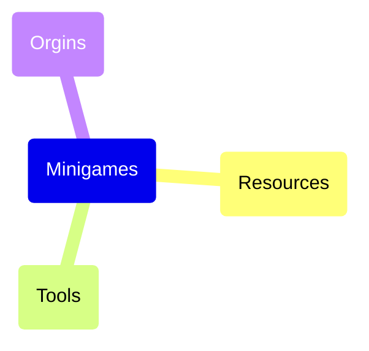
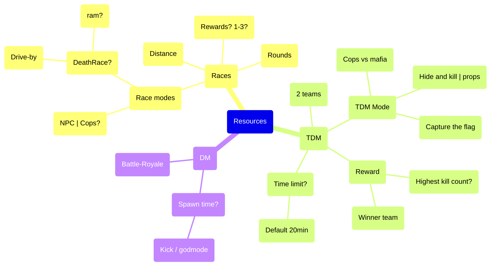
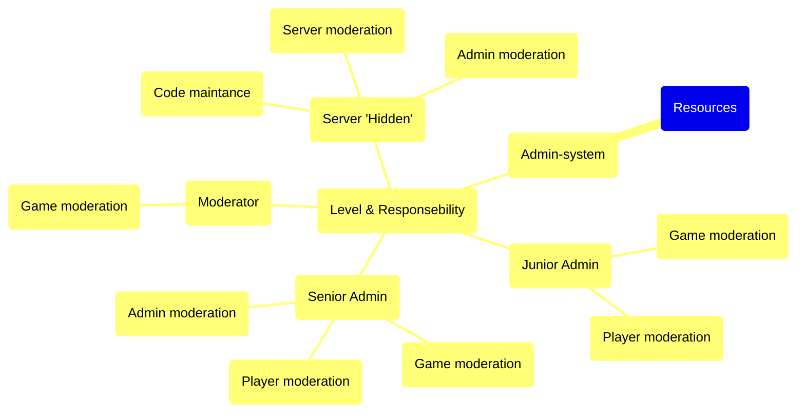

#   Mind maps

##  Overview

```mermaid
mindmap
    root(Minigames)
        A(Resources)
        B(Tools)
        C(Orgins)
```

##  Resources - Gamemode

```mermaid
mindmap
    root(Resources)
        A(Races)
            AA(Distance)
            AB(Race modes)
                AB1(NPC | Cops?)
                AB2(DeathRace?)
                    AB2A(Drive-by)
                    AE2(ram?)

            AC(Rewards? 1-3?)
            AD(Rounds)
        B(TDM)
            BA(2 teams)
            BB(TDM Mode)
                BBA(Cops vs mafia)
                BBB(Capture the flag)
                BBC(Hide and kill | props)

            BC(Time limit?)
                BCA(Default 20min)

            BC(Reward)
                BCA(Highest kill count?)
                BCA(Winner team)

        C(DM)
            CA(Spawn time?)
                CAA(Kick / godmode)
            CB(Battle-Royale)
```
##  Resources - Admin system

```mermaid
mindmap
    root(Resources)
        A(Admin-system)
            AA(Level & Responsebility)
                AAA(Moderator)
                    AAA1(Game moderation)

                AAB(Junior Admin)
                    AAB1(Game moderation)
                    AAB2(Player moderation)

                AAC(Senior Admin)
                    AAC1(Game moderation)
                    AAC2(Player moderation)
                    AAC3(Admin moderation)

                AAD(Server 'Hidden')
                    AAD3(Code maintance)
                    AAD3(Server moderation)
                    AAD3(Admin moderation)
                    

```
